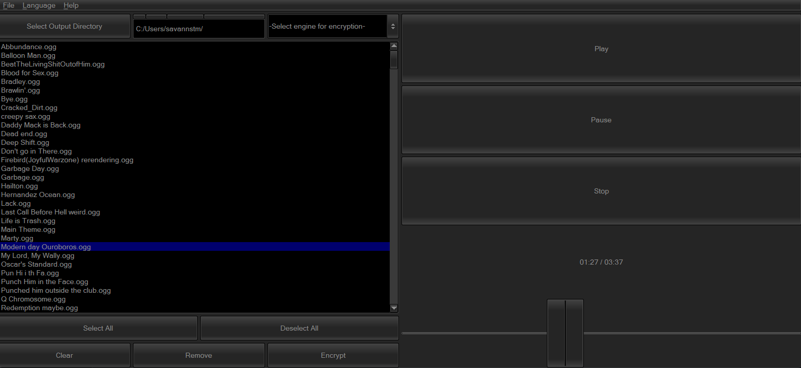
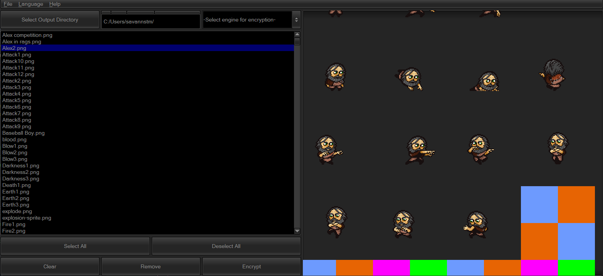

# rpgmdec

[README на русском](./README-ru.md)

RPGMDec is a universal, lightweight (1 MB executable) and fast GUI for decrypting RPG Maker XP/VX/VXAce `.rgssad`/`.rgss2a`/`.rgss3a` archives and RPG Maker MV/MZ `.rpgmvp`/`.png_`, `.rpgmvo`/`ogg_`, `.rpgmvm`/`m4a_` assets.

It also supports encryption of the aformentioned archives and assets.

`rpgmdec` is built on top of **BLAZINGLY FAST** 🔥🔥 Rust 🦀🦀🦀 libraries:

-   [rpgm-asset-decrypter-lib](https://github.com/rpg-maker-translation-tools/rpgm-asset-decrypter-lib)
-   [rpgm-archive-decrypter-lib](https://github.com/rpg-maker-translation-tools/rpgm-archive-decrypter-lib)

## Installation

Get the binaries in **Releases** section.

## Usage

See [Help](./docs/help.md).

## Supported Formats

On top of allowing you to decrypt/encrypt assets, program also allows you to play audio, inspect images **AND** even inspect `ttf`/`otf` fonts.

### Decrypt

-   Archives: `.rgssad`, `rgss2a`, `rgss3a`
    -   Data: `rxdata`, `rvdata`, `rvdata2`
    -   Images: `png`
    -   Audio: `ogg`, `m4a`
    -   Fonts: `ttf`, `otf`
-   Assets: `.rpgmvp`/`.png_`, `.rpgmvo`/`ogg_`, `.rpgmvm`/`m4a_`

### Encrypt

-   Data: `rxdata`, `rvdata`, `rvdata2`
-   Images: `png`
-   Audio: `ogg`, `m4a`
-   Fonts: `ttf`, `otf`

## License

Project is licensed under WTFPL.
